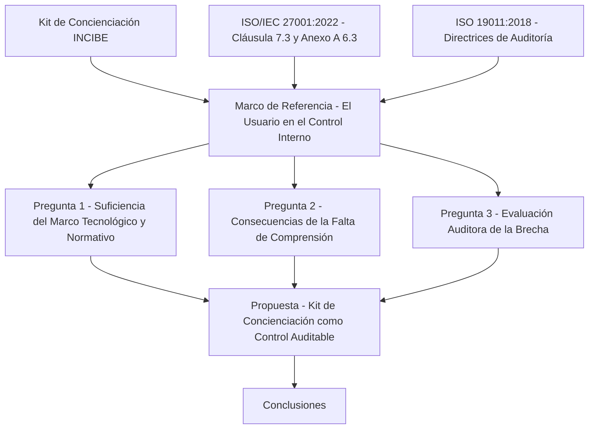
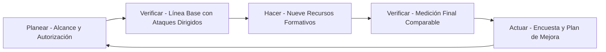

# El Usuario Como Pieza Fundamental Del Despliegue De Controles Internos
### Análisis del factor humano en los SGSI y de su verificación en el proceso auditor
#### Calidad y Auditoría de Sistemas de Información - Laboratorio No. 2

---

Este repositorio contiene el informe desarrollado para el **Laboratorio No. 2** de la asignatura **Calidad y Auditoría de Sistemas de Información**, centrado en el rol del usuario como componente esencial de los controles internos de seguridad de la información.

El trabajo analiza tres cuestiones: si un **SGSI** puede cumplir sus expectativas imponiendo únicamente un marco tecnológico y normativo, cuáles son las consecuencias de que los usuarios no comprendan las medidas de seguridad, y por qué y cómo un auditor debe evaluar la brecha entre las políticas declaradas y el uso real de la tecnología.

## Contenido del repositorio:

- `Desarrollo_Proyecto_Alejandro_De_Mendoza_Tovar.pdf` → Informe completo del laboratorio, con marco de referencia, desarrollo de las tres preguntas, propuesta de aplicación y conclusiones.

## Estructura del análisis

## Ciclo PHVA aplicado al programa de concienciación

## Fundamento normativo utilizado

- **ISO/IEC 27001:2022** → Cláusula 7.3 (Toma de conciencia) y control A.6.3 del Anexo A (Concienciación, educación y formación).
- **ISO/IEC 27002:2022** → Guía de implementación de los controles de seguridad.
- **ISO 19011:2018** → Fuentes de información y técnicas de recopilación de evidencia de auditoría.
- **Ley 1581 de 2012** → Régimen colombiano de protección de datos personales.

## Contenido del informe

El documento incluye cinco tablas de elaboración propia:

1. Elementos de implantación de un SGSI y efecto de su omisión.
2. Tipología de consecuencias derivadas de la falta de comprensión de las medidas de seguridad.
3. Técnicas de evaluación de la brecha entre política declarada y uso real.
4. Indicadores propuestos para la verificación auditora del factor humano.
5. Mapeo del Kit de Concienciación sobre el ciclo PHVA y evidencia auditable resultante.

## Autor:

Este laboratorio fue desarrollado en el marco de la asignatura **Calidad y Auditoría de Sistemas de Información**, bajo la dirección del **Ing. y Dr. Wilson Castaño Galvis**, en la **Fundación Universitaria Internacional de La Rioja (UNIR)**, Bogotá D.C.

- ***Alejandro De Mendoza Tovar*** – [Perfil GitHub](https://github.com/AlejoTechEngineer)

---
